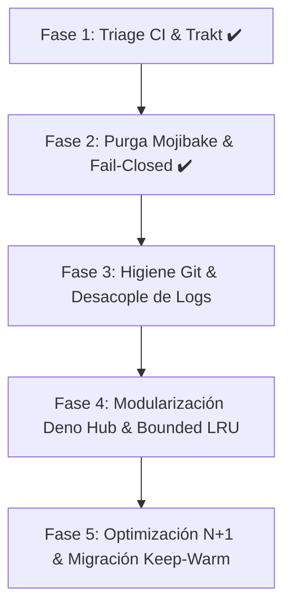

# 🏛️ INFORME FORENSE Y MAPA ESTRUCTURAL DEFINITIVO
## Ecosistema MejoraStremio — Arquitectura, Diagnóstico de CI y Deuda Técnica

**Fecha de Emisión:** 2026-10-06  
**Autor:** Senior Software Architect & Lead Forensic SRE  
**Proyecto:** `MejoraStremio`  
**Entorno de Producción:** Android TV / TV Box (Leanback UI) — Cuenta `stremioeg@gmail.com`  
**Clasificación:** Auditoría Técnica Exhaustiva de Solo Lectura

---

## 📑 TABLA DE CONTENIDOS
1. [Naturaleza y Propósito del Repositorio](#1-naturaleza-y-propósito-del-repositorio)
2. [Topografía Arquitectónica (Diagrama del Sistema)](#2-topografía-arquitectónica)
3. [Diagnóstico Forense de los Fallos en GitHub Actions](#3-diagnóstico-forense-de-los-fallos-en-github-actions)
4. [Matriz de Estado de Módulos (Qué Funciona vs Qué Está Roto)](#4-matriz-de-estado-de-módulos)
5. [Autopsia de Deuda Técnica y Vulnerabilidades Latentes](#5-autopsia-de-deuda-técnica-y-vulnerabilidades-latentes)
6. [Inventario Maestro de Secretos y Llaves de API](#6-inventario-maestro-de-secretos-y-llaves-de-api)
7. [Mapeo Completo del Sistema de Archivos](#7-mapeo-completo-del-sistema-de-archivos)
8. [Plan Estratégico de Acción y Refactorización](#8-plan-estratégico-de-acción-y-refactorización)

---

## 1. NATURALEZA Y PROPÓSITO DEL REPOSITORIO

**MejoraStremio** es una plataforma distribuida de ingeniería perimetral (Edge Middleware sobre Deno Deploy + Automatización Serverless en GitHub Actions) diseñada para resolver las fallas estructurales y de ergonomía de Stremio en dispositivos de sala de estar (**Android TV / TV Box en interfaz Leanback**).

### Los 5 Pilares de Ingeniería:
1. **Priorización Absoluta de Audio Latino y TorBox Debrid:** Evita descargas P2P lentas sin semillas vivas y bloqueos por CGNAT clasificando y posicionando en el orden #1 los streams cacheados en Debrid (`[⚡ INSTANTÁNEO] [🌎 LATINO] [TB+]`).
2. **Smart Audio Sync (Corrección de Framerate PAL $\to$ WEB-DL):** Elimina la deriva temporal acumulativa (+2.28 minutos por hora) producida entre capturas de TV europea a 25.000 fps y rips digitales a 23.976 fps (*HPI*, *Tatort*) mediante reescalado matemático en tiempo real con orden monótono anti-crash para ExoPlayer.
3. **Subtítulos Estrictos Sin SDH y Traducción IA Dinámica:** Purgado estricto de acotaciones auditivas (`[Música]`, `(Risas)`, `PERSONAJE:`) y traducción generativa automática vía Gemini Flash ante la ausencia de subtítulos comunitarios en español.
4. **Curaduría Dinámica de Estrenos y Cartelera:** Mantenimiento de ventanas temporales deslizantes sobre catálogos de TMDB en ElfHosted sin fechas congeladas.
5. **Gobernanza de Cuentas y Poda Leanback:** Reducción del scroll infinito de la TV Box (de 65 filas a 10 filas esenciales en Home) y prevención de corrupción de manifests (`catalogs: []`).

---

## 2. TOPOGRAFÍA ARQUITECTÓNICA

```mermaid
graph TB
    subgraph "NIVEL 1: Dispositivo Final (Leanback TV Box)"
        TVBox["Android TV (ExoPlayer / libmpv)<br/>Cuenta: stremioeg@gmail.com"]
    end

    subgraph "NIVEL 2: Edge Proxy Serverless (Deno Deploy)"
        Hub["mejorastremio-hub.pabloeckert.deno.net<br/>scripts/deno-hub.ts (4,221 líneas)"]
        StreamRanker["Smart Stream Interceptor (/streams)"]
        SubProxies["SubDL / OpenSubtitles / SubSource (/sub*)"]
        SmartSync["Smart Audio Sync Engine (25→23.976fps)"]
        TranslateEngine["Gemini Flash Translation (/translate)"]
        DenoKV[("Deno KV Persistent Cache")]
    end

    subgraph "NIVEL 3: Metadata Cloud (ElfHosted)"
        AIOMetadata["AIOMetadata Instance<br/>(aiometadata.elfhosted.com)"]
        MyTrakt["MyTrakt Sync | ElfHosted<br/>(mytrakt.elfhosted.com)"]
    end

    subgraph "NIVEL 4: SRE Automatizado (GitHub Actions Workflows)"
        DailyRefresh["daily-catalog-refresh.yml (07:00 ART)"]
        PremiereRadar["premiere-radar.yml (07:15 ART)"]
        TatortPrewarm["tatort-subs-prewarm.yml (07:30 ART)"]
        TorBoxAirlock["torbox-airlock.yml (07:45 ART)"]
        HealthMonitor["health-monitor.yml (09:00 / 21:00 ART)"]
        GitRepo[("GitHub Repo: origin/main<br/>data/internal-log.jsonl")]
    end

    subgraph "Proveedores Upstream & APIs"
        StremioAPI["Stremio API (api.strem.io)"]
        TorBoxAPI["TorBox Debrid API"]
        TMDBAPI["TMDB API"]
        SubDLApi["SubDL API"]
        OpenSubsApi["OpenSubtitles REST API v1"]
        SubSourceApi["SubSource API"]
        GeminiAPI["Google Gemini AI"]
        TorrentioUpstream["Torrentio Scraper"]
        CometUpstream["Comet Scraper"]
    end

    TVBox -->|Lee Manifiestos y Catálogos| StremioAPI
    TVBox -->|Pide Streams| Hub
    TVBox -->|Pide Subtítulos| Hub
    Hub --> StreamRanker
    Hub --> SubProxies
    Hub --> SmartSync
    Hub --> TranslateEngine
    StreamRanker --> TorrentioUpstream
    StreamRanker --> CometUpstream
    SubProxies --> SubDLApi
    SubProxies --> OpenSubsApi
    SubProxies --> SubSourceApi
    TranslateEngine --> GeminiAPI
    TranslateEngine <--> DenoKV
    Hub <--> DenoKV

    DailyRefresh -->|Regenera UUID| AIOMetadata
    DailyRefresh -->|Actualiza Fechas| StremioAPI
    PremiereRadar -->|Consulta Continue Watching| MyTrakt
    PremiereRadar -->|Verifica Cache| TorBoxAPI
    TorBoxAirlock -->|Evita Expiración 30d| TorBoxAPI

    DailyRefresh -->|Commits de Log| GitRepo
    PremiereRadar -->|Commits de Log| GitRepo
    HealthMonitor -->|Commits de Log| GitRepo
    TorBoxAirlock -->|Commits de Log| GitRepo
```



---

## 3. DIAGNÓSTICO FORENSE DE LOS FALLOS EN GITHUB ACTIONS

### 3.1 Causa Raíz de `premiere-radar.yml` (Octubre 3 al 6 de 2026)
* **Workflow:** `.github/workflows/premiere-radar.yml`
* **Runs Afectados:** `37498485275` (hoy), `37362271784`, `37212651438`, `37130609609`.
* **Causa Raíz Comprobada:** Expiración del token OAuth de Trakt.tv en la instancia MyTrakt Sync de ElfHosted (`13e948e9-04c8-4917-a0d5-96af15b63d2f`).
* **Comportamiento Upstream:** El endpoint devuelve HTTP 200 con un único elemento dummy:
  ```json
  {
    "id": "trakt_auth_required:1",
    "name": "Trakt Authentication Required",
    "description": "Please authenticate with Trakt.tv to access your personal Trakt lists and watch history."
  }
  ```
* **Mecánica de la Ruptura:** Como el elemento carece de `imdb_id`, `shows.size` evaluaba a `0`. El script invocaba `die()` (`process.exit(1)`). Dado que el runner corre con `set -o pipefail`, el job colapsaba en rojo.
* **Mitigación Aplicada (Fase 1):** Detección semántica de `trakt_auth_required`, emisión de `::warning::` en CI y salida controlada `process.exit(0)`.

### 3.2 "El Efecto Avestruz" en `torbox-airlock.yml`
* **Diagnóstico:** En `scripts/torbox-airlock.mjs`, cuando `shows.size === 0`, el script salía con `process.exit(0)`.
* **Impacto Silencioso:** El workflow marcaba verde en GitHub Actions, pero **llevaba 4 días sin aplicar airlock a ningún torrent**. El usuario creía que su caché estaba protegida contra purgas a 30 días cuando en realidad el motor estaba inoperativo.
* **Mitigación Aplicada (Fase 1):** Inyección de advertencia semántica visible en CI.

---

## 4. MATRIZ DE ESTADO DE MÓDULOS

| Componente / Script | Estado | Diagnóstico Operativo |
| :--- | :---: | :--- |
| **Smart Stream Interceptor** (`deno-hub.ts`) | 🟢 **OPERATIVO** | Normaliza URLs de Torrentio preservando pipes/comas de TorBox. Prioriza streams cacheados y audio latino (`[⚡ INSTANTÁNEO] [🌎 LATINO] [TB+]`). |
| **Smart Audio Sync** (`deno-hub.ts`, `addon-signals.mjs`) | 🟢 **OPERATIVO** | Parser canónico en memoria (`parseSrtToCues`), orden cronológico estricto y anti-collision clamping para prevenir crash en ExoPlayer. |
| **Subtítulos Sin SDH** (`deno-hub.ts`) | 🟢 **OPERATIVO** | Filtro de marcas auditivas en SubDL, OpenSubtitles Latino y SubSource. Mapeo dual `spl` y `spa` para corregir el bug de Stremio Core. Top 2 por addon. |
| **Traducción IA Gemini Flash** (`deno-hub.ts`) | 🟢 **OPERATIVO** | Fast-Window sub-4s (primeras 70 cues) + cola asíncrona en Deno KV. Preserva nombres propios y diálogo cinematográfico neutro. |
| **Curaduría Home Leanback** (`apply-stremioeg-profile.mjs`) | 🟢 **OPERATIVO** | Poda de 65 a 10 filas esenciales en Home. 173 catálogos en Discover. Soporte `--dry-run` y `--rollback-last`. |
| **Radar de Estrenos** (`premiere-radar.mjs`) | 🟡 **MITIGADO** | Error de CI controlado. Requiere re-vincular Trakt en `https://mytrakt.elfhosted.com` para reanudar el tracking diario. |
| **TorBox AirLock** (`torbox-airlock.mjs`) | 🟡 **MITIGADO** | Silenciamiento corregido con warning en CI. Requiere re-autenticación de Trakt para volver a proteger descargas. |
| **AIOMetadata Refresh** (`regenerate-aiometadata.mjs`) | 🟡 **DEUDA** | Opera, pero genera un nuevo UUID en ElfHosted diariamente sin borrar instancias viejas (acumulación infinita de configuraciones huérfanas). |
| **Log Interno CI** (`ci-commit-push.sh`, `internal-log.jsonl`) | 🔴 **CRÍTICO** | 10 workflows diarios commitean a `main` para escribir 1 línea. 1.47 MB de log. Reseteos forzados de Git para zafar de carreras. |
| **Caché en RAM Deno Hub** (`deno-hub.ts`) | 🔴 **CRÍTICO** | `subdlMemCache` e `imdbIdCache` son mapas en RAM sin límite ni LRU. Riesgo latente de OOM en Deno Deploy (512 MB límite). |
| **Perfil Joaquín (`stremiojn`)** | 🔴 **FANTASMA** | Documentado en `GEMINI.md` y referenciado en código, pero el directorio no existe físicamente en el repositorio. |
| **Scripts Legacy Monolito** (`deno-*-addon.ts`) | ⚪ **ABANDONADO** | Archivos previos a la consolidación de `deno-hub.ts`. No están deployados y contienen errores de tipo. |

---

## 5. AUTOPSIA DE DEUDA TÉCNICA Y VULNERABILIDADES LATENTES

### 5.1 Corrupción de Encoding Mojibake (Saneada en Fase 2)
* **Causa Raíz:** Archivos guardados bajo codificación Windows-1252 interpretando bytes UTF-8 corrompieron símbolos funcionales:
  - `👤` se convirtió en `👤` en `addon-signals.mjs`. `seedCount` devolvía `null` y `isRealStream` aceptaba torrents muertos con 0 semillas.
  - `⚡` se convirtió en `âš¡`. `isCachedStream` no detectaba streams cacheados de Comet (`[TB⚡]`).
  - `🇲🇽`, `🇦🇷`, `🇨🇴` se corrompieron en `anti-frustration.mjs`.
* **Solución Aplicada (Fase 2):** Restauración canónica de caracteres Unicode y tolerancia a variantes heredadas.

### 5.2 El Guard Fail-Closed (Blindado en Fase 2)
* **Causa Raíz:** En `collection-guard.mjs`, si el fetch del manifest en vivo fallaba (`live === null`), `liveCatalogs` valía 0 y el guard no abortaba, permitiendo persistir catálogos vacíos (`catalogs: []`).
* **Solución Aplicada (Fase 2):** Implementación de política Zero-Trust fail-closed: si el endpoint no responde tras un reintento, se aborta la escritura por precaución.

### 5.3 Abuso de Git como Base de Datos de Telemetría
* **Problema:** 10 ejecuciones cron diarias commitean directamente sobre `main` para agregar una línea a `data/internal-log.jsonl`.
* **Riesgo:** Carreras de rebase constantes, historial de Git inutilizable y crecimiento desmedido de `.git`.
* **Remediación Futura (Fase 3):** Desacoplar el log interno hacia GitHub Actions Artifacts o Deno KV.

### 5.4 Caches sin Desalojo en Deno Deploy
* **Problema:** `subdlMemCache` acumula textos SRT completos en RAM sin expirar.
* **Riesgo:** Colapso por OOM en Deno Deploy al superar 512 MB.
* **Remediación Futura (Fase 4):** Implementar mapa con límite estricto de entradas (LRU) y TTL.

### 5.5 Cascada N+1 en TMDB Discover
* **Problema:** `handleDiscover` dispara 20 llamadas HTTP individuales a TMDB por cada página solicitada para resolver `tmdb_id -> imdb_id`.
* **Riesgo:** Latencias de hasta 3.5 segundos en Android TV y bloqueos por HTTP 429 Too Many Requests.
* **Remediación Futura (Fase 5):** Persistir los mapeos inmutables en Deno KV.

### 5.6 Despilfarro de Runners en `keep-warm.yml`
* **Problema:** Corre cada 20 minutos (2,160 ejecuciones al mes) levantando máquinas virtuales de Ubuntu solo para hacer un `curl`.
* **Remediación Futura (Fase 5):** Migrar a Cloudflare Worker o servicio cron serverless gratuito.

---

## 6. INVENTARIO MAESTRO DE SECRETOS Y LLAVES DE API

### 6.1 Secretos de Deno Deploy (`mejorastremio-hub`)
Configurados en la consola de Deno Deploy:

| Variable | Servicio | Requerida | Impacto de Ausencia |
| :--- | :--- | :---: | :--- |
| `GEMINI_API_KEY` | Google AI Studio | **SÍ (Crítica)** | Desactiva `com.mejorastremio.translate`. Sin subtítulos IA para series europeas o clásicas. |
| `SUBDL_KEY` | SubDL API | **SÍ** | Desactiva `com.mejorastremio.subdl`. Sin subtítulos sin SDH para cine moderno. |
| `OPENSUBTITLES_API_KEY` | OpenSubtitles REST v1 | **SÍ** | Desactiva `com.mejorastremio.opensubtitles-latino` y la búsqueda de pistas base para IA. |
| `SUBSOURCE_API_KEY` | SubSource API | Recomendada | Desactiva `com.mejorastremio.subsource`. Menor redundancia. |
| `TMDB_API_KEY_AISEARCH` | TMDB API v3 | **SÍ** | Invalida `/discover`, `/miniseries` y `/short-series` (error 500). |
| `TORRENTIO_URL` | Torrentio Scraper | Opcional | Permite apuntar a un mirror privado (default: `https://torrentio.strem.fun/`). |
| `SUBDIVX_PROXY_URL` | SubDivX Proxy | Opcional | Proxy de raspado para SubDivX (default: `https://stremio-subdivx.xor.ar`). |
| `OPENROUTER_API_KEY` | OpenRouter | Opcional | Fallback degradado si Gemini se agota (desactivado por omisión por latencia). |

### 6.2 Secretos de GitHub Actions (Repository Secrets)
Configurados en GitHub:

| Variable | Uso | Requerida | Impacto de Ausencia |
| :--- | :--- | :---: | :--- |
| `STREMIO_EMAIL` / `_PASS` | Stremio Core API | **SÍ (Crítica)** | Imposibilita login a `stremioeg@gmail.com`. Caen refresh, monitor, radar y airlock. |
| `AIO_PASSWORD` | ElfHosted AIOMetadata | **SÍ** | `/api/config/save` rechaza regeneración de catálogos. Cartelera estancada. |
| `TORBOX_API_KEY` | TorBox Debrid API | **SÍ** | TorBox AirLock inoperativo; TorBox borra descargas a los 30 días. |
| `DENO_DEPLOY_TOKEN` | Deno Deploy CLI | **SÍ** | Impide despliegues automáticos desde `deploy-deno-hub.yml`. |
| `STREMIO_EMAIL_TEEN` / `_PASS_TEEN` | Stremio Core API | Para solotveg | La cuenta juvenil `solotveg@gmail.com` no se actualiza en el cron diario. |
| `GITHUB_TOKEN` | GitHub Actions | Automática | Evita rate limit de 60 req/h en `community-radar.mjs`. |

### 6.3 Tokens Externos en ElfHosted
No residen en el repositorio:

| Token | Ubicación | Estado | Diagnóstico |
| :--- | :--- | :---: | :--- |
| **Trakt.tv OAuth** | MyTrakt Sync (`13e948e9-...`) | 🔴 **EXPIRADO** | La instancia devuelve `trakt_auth_required:1`. Debe re-vincularse en `https://mytrakt.elfhosted.com`. |
| **Simkl OAuth** | AIOMetadata (`2d8ff56f-...`) | 🟢 **ACTIVO** | AIOMetadata preserva la sincronización server-side. |

---

## 7. MAPEO COMPLETO DEL SISTEMA DE ARCHIVOS

```text
MejoraStremio/
├── .agents/rules/zero-trust-principal-engineer.md  [🟢 VINCULANTE: Regla de SRE y Zero-Trust]
├── .backups/                                       [🟢 SANO: 112+ snapshots JSON pre-mutación]
├── .github/workflows/                             [19 Workflows de automatización y monitoreo]
├── cuentas/
│   ├── stremioeg/
│   │   ├── GEMINI.md                               [🟢 SANO: Gobernanza cuenta principal TV Box]
│   │   └── profile.json                            [🟢 SANO: Especificación v1.0.1 de addons/audio]
│   ├── solotveg/aiometadata-instance.json          [🟢 SANO: UUID instancia PG-13 adolescente]
│   └── stremiojn/                                  [🔴 FANTASMA: Declarada en docs, NO EXISTE en disco]
├── data/
│   ├── anti-frustration-log.json                   [🟢 SANO: Registro de títulos con baja disponibilidad]
│   ├── community-radar-state.json                  [🟢 SANO: Estado de versiones de addons comunitarios]
│   ├── internal-log.jsonl                          [🔴 CRÍTICO: 1.47 MB de log vía Git commits]
│   ├── iptv-channels.json                          [🟢 SANO: Canales HLS verificados]
│   ├── premiere-radar-state.json                   [🟢 SANO: Estado persistente de estrenos listos]
│   ├── preset.json                                 [🟢 SANO: 183 catálogos de AIOMetadata]
│   ├── tatort-coverage.jsonl                       [🟢 SANO: Cobertura procedurales alemanes]
│   ├── tatort-prewarm-state.json                   [🟢 SANO: Estado precalentamiento subs IA]
│   └── test-content.json                           [🟢 SANO: Títulos curados de prueba]
├── docs/encuesta-catalogos.md                      [⚪ HISTÓRICO: Snapshot documental]
├── scratch/                                        [🟢 SANO: Scripts de verificación E2E]
├── scripts/
│   ├── lib/
│   │   ├── addon-signals.mjs                       [🟢 REFACTORIZADO: Heurísticas, seeds 👤, debrid ⚡]
│   │   ├── ci-commit-push.sh                       [🟡 FRÁGIL: Reset/push contra carreras de Git]
│   │   ├── collection-guard.mjs                    [🟢 BLINDADO: Guard fail-closed contra catálogos vacíos]
│   │   └── stremio-api.mjs                         [🟢 SANO: Cliente HTTP centralizado api.strem.io]
│   ├── deno-hub.ts                                 [🔴 MONOLITO: 4,221 líneas, router edge Deno Deploy]
│   ├── premiere-radar.mjs                          [🟢 CORREGIDO: Detección semántica trakt_auth_required]
│   ├── torbox-airlock.mjs                          [🟢 CORREGIDO: Detección semántica trakt_auth_required]
│   ├── apply-stremioeg-profile.mjs                 [🟢 SANO: Orquestador con dry-run y rollback]
│   ├── test-stremioeg-tvbox.mjs                    [🟢 SANO: Suite de 28 pruebas unitarias/integración]
│   ├── simulate-tv-boot.mjs                        [🟢 SANO: Simulador encendido en frío TV Box]
│   ├── test-tvbox-deep-e2e.mjs                     [🟢 SANO: Suite de validación E2E en 2 pasadas]
│   └── [48 scripts adicionales de soporte]         [⚪ MIXTO: Mantenimiento, auditoría y legacy]
├── deno.jsonc                                      [🟢 SANO: Configuración Deno y KV unstable]
├── GEMINI.md                                       [🟢 SANO: Fuente de verdad unificada de arquitectura]
├── RESCATE_EXITOSO_2026.md                         [🟢 SANO: Certificación rescate ExoPlayer y SmartSync]
└── REPORTE_AUDITORIA.md                            [⚪ HISTÓRICO: Auditoría de septiembre 2026]
```

---

## 8. PLAN ESTRATÉGICO DE ACCIÓN Y REFACTORIZACIÓN



### 📋 Fases Completadas:
* [x] **Fase 1 (Triage CI & Radar):** Detección semántica de `trakt_auth_required` en `premiere-radar.mjs` y `torbox-airlock.mjs`. Warnings visibles en GitHub Actions y salida controlada sin romper CI.
* [x] **Fase 2 (Purga de Encoding y Fail-Closed):** Restauración de `👤`, `⚡`, `🇲🇽`, `🇦🇷`, `🇨🇴` en heurísticas de streaming y blindaje fail-closed en `collection-guard.mjs`.

### 📋 Próximas Fases a Ejecutar:
* [ ] **Fase 3 (Higiene Git CI):** Desacoplar `internal-log.jsonl` de Git commits directos hacia GitHub Artifacts o Deno KV para eliminar las carreras de rebase crónicas. Consolidar commits en `daily-catalog-refresh.yml`.
* [ ] **Fase 4 (Modularización Deno Hub):** Separar las 4,221 líneas de `deno-hub.ts` en submódulos temáticos (`subtitles/`, `streams/`, `translate/`, `catalogs/`). Reemplazar los `Map` en RAM por mapas LRU con límite de entradas y TTL.
* [ ] **Fase 5 (Optimización de Red y Eliminación de Desperdicio):** Persistir mapeos `tmdb_id -> imdb_id` en Deno KV para eliminar el waterfall N+1 de Discover. Migrar el ping de cada 20 minutos de `keep-warm.yml` a un disparador serverless liviano sin consumo de runners de GitHub Actions.
* [ ] **Acción Manual Requerida por el Usuario:** Ingresar a [https://mytrakt.elfhosted.com](https://mytrakt.elfhosted.com) y refrescar la vinculación OAuth de Trakt.tv.
