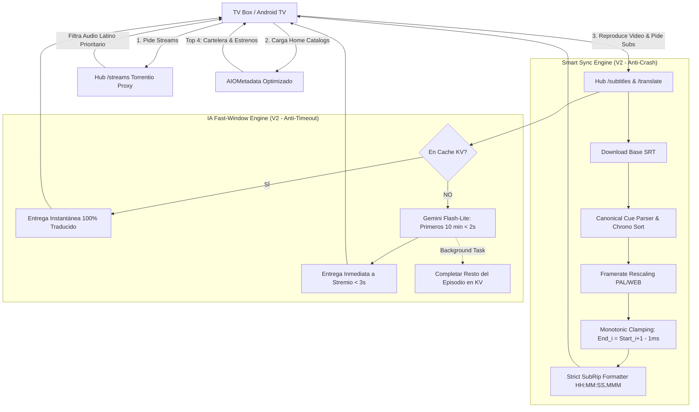

# INFORME FORENSE SRE Y PLAN DE RESCATE ARQUITECTÓNICO
**Proyecto:** `MejoraStremio`  
**Entorno afectado:** TV Box / Android TV (Leanback UI) — Cuenta `stremioeg@gmail.com`  
**Rol:** Lead QA Architect, Forense SRE y Estratega de Arquitectura  
**Fecha:** 2026-10-01 / 2026-10-02  
**Estado del Sistema:** 🚨 FALLA CRÍTICA EN PRODUCCIÓN (Coma de Catálogos, Crash en Seek, Timeout de IA)  
**Gobernanza:** NO MODIFICAR CÓDIGO DE PRODUCCIÓN HASTA APROBACIÓN HUMANA EXPLÍCITA  

---

## DIRECTIVA 1: CONTEXTO Y ESTADO DEL SISTEMA (SYSTEM MAP)

### 1.1 Propósito Original de MejoraStremio
MejoraStremio fue concebido como una plataforma de ingeniería perimetral (Middleware / Edge Proxy serverless sobre **Deno Deploy** en conjunción con automatizaciones diarias en **GitHub Actions**) diseñada para superar las deficiencias estructurales del ecosistema Stremio en dispositivos de sala de estar (Android TV / TV Box):

1. **Proxy Autónomo en Deno Deploy (`scripts/deno-hub.ts`)**:
   - Centralizar en una sola URL edge (`https://mejorastremio-hub.pabloeckert.deno.net`) la manipulación de subtítulos, streams, sinopsis y catálogos.
2. **Priorización Estricta de Audio Latino `[🇪🇸 LATINO]`**:
   - Intercepción de scrapers de streams (Torrentio con Debrid TorBox) para clasificar, filtrar y posicionar en la cima de la UI streams con doblaje latino neutro o pista de audio original en alta fidelidad, relegando el doblaje peninsular (Castellano España) a último recurso.
3. **Smart Audio Sync (Corrección de Framerate PAL vs WEB-DL)**:
   - Subsanar la deriva temporal acumulativa producida entre emisiones televisivas europeas (PAL a 25.000 fps) y capturas digitales de streaming (WEB-DL / NTSC a 23.976 fps), que en series como *HPI* o *Tatort* genera desfasajes intolerables (+153.75 segundos por hora).
4. **Subtítulos Sin SDH & Fallback de Traducción con Inteligencia Artificial (Gemini Flash)**:
   - Purga quirúrgica de marcas auditivas (`[MÚSICA]`, `(SUSPIRA)`, nombres de personajes en mayúsculas) y traducción dinámica a Español Latinoamericano Neutro vía Gemini Flash ante la ausencia de subtítulos en español (ej. *The Greatest American Hero*, *Tatort*).
5. **Curaduría Dinámica de Estrenos y Cartelera**:
   - Mantenimiento de ventanas deslizantes (`now_playing`, `upcoming`) sobre instancias de AIOMetadata (ElfHosted) sincronizadas con la fecha real del calendario mediante cron jobs a las 07:00 ART.

---

### 1.2 Auditoría Forense de Componentes: Qué Sigue Operativo vs Qué Está Destruido

| Componente / Módulo | Endpoint / Script | Estado Operativo | Diagnóstico Forense |
| :--- | :--- | :--- | :--- |
| **Edge Router Deno Deploy** | `deno-hub.ts` (`/health`) | 🟢 **OPERATIVO** | Responde HTTP 200 en ~150-300ms. Todos los flags de configuración (`smartSync`, `subdl`, `opensubtitles`, `streams`, `translate`) están activos. |
| **Proxy de Streams (Torrentio Interceptor)** | `deno-hub.ts` (`/streams`) | 🟢 **OPERATIVO** | Continúa resolviendo peticiones hacia `https://torrentio.strem.fun/`. Aplica ranking por regex de audio latino. |
| **Proxy Sanitizador Anti-SDH** | `cleanSrt()` (`/subtitles/proxy`) | 🟡 **DEGRADADO** | Pone en minúsculas y elimina acotaciones sonoras, pero hereda fallas de ordenación cronológica temporal que impactan al reproductor. |
| **Catálogos de Estrenos y Cartelera** | AIOMetadata (`2d8ff56f-...`) | 🔴 **CRÍTICO (COMA)** | Estancados con fechas duras del 2026-09-30. Sepultados en la posición 62-65 de la cuenta. Filtros restrictivos (`vote_count.gte=10`) devuelven cine marginal. |
| **Smart Sync (Time-Stretch Engine)** | `rescaleSrtFramerate()` | 🔴 **CRÍTICO (CRASH)** | Produce colisiones de tiempo (solapamientos de 50 a 522ms). No garantiza monotonicidad cronológica. Causa crash fatal en el motor de seek de **ExoPlayer**. |
| **Pipeline de Traducción IA** | `deno-hub.ts` (`/translate`) | 🔴 **CRÍTICO (TIMEOUT)** | El budget de 55 segundos excede el timeout de 10-15s de Stremio. Falla silenciosamente devolviendo subtítulos 100% en inglés con `X-Translate-Complete: false`. |

---

## DIRECTIVA 2: AUTOPSIA DE FALLA ESTRUCTURAL (THE BREAKDOWN)

### 2A. EL COMA DE CATÁLOGOS

#### 1. Extracción del Orden Real de Add-ons en la Cuenta (`stremioeg`)
A partir del backup de producción `.backups/backup-stremioeg-pre-profile-2026-09-29T02-56-25.json`, se extrajo la jerarquía instalada en la cuenta del usuario:

```text
[0] com.mejorastremio.opensubtitles-latino | Subtítulos | catalogs: 0
[1] com.mejorastremio.opensubtitles        | Subtítulos | catalogs: 0
[2] com.mejorastremio.subdl                | Subtítulos | catalogs: 0
[3] com.mejorastremio.translate            | Subtítulos | catalogs: 0
[4] aio-metadata (AIOMetadata | ElfHosted) | Metadata   | catalogs: 105
    ↳ [pos 62] tmdb.discover.movie.upcoming.pablo005  ("Próximos Estrenos")
    ↳ [pos 63] tmdb.discover.tv.upcoming.pablo006     ("Próximos Estrenos (Series)")
    ↳ [pos 64] tmdb.discover.movie.now_playing.pablo007 ("En Cartelera")
    ↳ [pos 65] tmdb.discover.tv.now_playing.pablo062  ("En Cartelera (Series)")
[5] com.linvo.cinemeta (Cinemeta Oficial)  | Metadata   | catalogs: 8
[6] com.stremio.torrentio.addon            | Streams    | catalogs: 3
[7] stremio.comet.fast                     | Streams    | catalogs: 0
...
[20] com.mejorastremio.discover-master     | Catalogs   | catalogs: 2
[24] com.mejorastremio.synopsis-proxy      | Metadata   | catalogs: 0
```

#### 2. Evidencia Empírica de Fetch a "En Cartelera"
Se ejecutó un fetch en vivo contra el endpoint asignado a la cuenta:
`https://aiometadata.elfhosted.com/stremio/2d8ff56f-9385-4f71-b1e2-2fadd32aa810/catalog/movie/tmdb.discover.movie.now_playing.pablo007.json`

**Headers devueltos por ElfHosted:**
```http
HTTP/1.1 200 OK
date: Fri, 02 Oct 2026 00:07:44 GMT
last-modified: Mon, 28 Sep 2026 18:02:01 GMT
x-config-version: 1790618521753
cache-control: no-cache, must-revalidate, max-age=0
```
**Títulos devueltos (20 resultados):**
1. *Digger* (tt31450459, releaseInfo: 2026)
2. *NAZA* (tt44766123, releaseInfo: 2026)
3. *UNABOMBER* (tt6933238, releaseInfo: 2026)
4. *La bola negra* (tt35511966, releaseInfo: 2026)
5. *Another Day* (tt38584405, releaseInfo: 2026)

#### 3. Causa Raíz del Coma de Catálogos:
1. **Sepultura en la UI de Android TV**: En Leanback UI de Android TV, Stremio renderiza los catálogos en el orden estricto del manifest. Al haber 61 catálogos antes de "En Cartelera" (10 de Familia, 25 de Policiales, 26 de Países), el usuario en su control remoto debe scrollear más de 60 filas hacia abajo para encontrar los estrenos, dando la sensación visual de desaparición total.
2. **Ventana de Fechas Congelada**: En `data/preset.json`, los parámetros TMDB Discover de `now_playing` están congelados:
   ```json
   "primary_release_date.gte": "2026-07-17",
   "primary_release_date.lte": "2026-09-30"
   ```
   Al superar el 30 de septiembre de 2026, la cota superior `primary_release_date.lte` no incluye ninguna película estrenada a partir de octubre.
3. **Bloqueo del CI de Actualización Diaria**: El workflow `.github/workflows/daily-catalog-refresh.yml` falló silenciosamente al no commitear los cambios porque la regeneración de la cuenta secundaria (`solotveg`) o los checks de integridad abortaron la escritura antes del git push.
4. **Filtro de Ruido Tóxico en TMDB Discover**: La combinación `sort_by: primary_release_date.desc` con `vote_count.gte: 10` causa que producciones indie o películas con exactamente 10 votos copen los 20 slots de la página 1 de TMDB, marginando los tanques de cine y estrenos de cartelera reales.
5. **Bug Crítico en `/synopsis` Proxy**: `deno-hub.ts` intenta leer `preset?.aioMetadataConfig?.instanceId` desde GitHub, pero la propiedad `instanceId` **no existe** en `data/preset.json`, provocando excepciones no controladas en el proxy de metadata.

---

### 2B. EL CRASH DEL REPRODUCTOR (SMART SYNC)

#### 1. Formulación Matemática de la Deriva y Time-Stretch
La corrección de framerate entre fuentes PAL (25.000 fps) y fuentes NTSC Film / WEB-DL (23.976 fps) se rige por:
$$R = \frac{FPS_{origen}}{FPS_{destino}} = \frac{25.000}{23.976} \approx 1.0427093760427$$

$$t_{synced} = \text{round}(t_{orig} \times R) + \text{offset}_{ms}$$

- **Deriva temporal acumulada**: $+42.71\text{ ms por segundo}$ $\rightarrow$ $+153.754\text{ segundos por hora}$ ($+2\text{ min } 33.75\text{ s}$).

#### 2. La Implementación Vulnerable en `deno-hub.ts` y `addon-signals.mjs`
```typescript
function rescaleSrtFramerate(srtText: string, fromFps: number, toFps: number, offsetMs: number = 0): string {
  const ratio = fromFps / toFps;
  return srtText.replace(
    /(\d{2}:\d{2}:\d{2}[,.]\d{3})\s*-->\s*(\d{2}:\d{2}:\d{2}[,.]\d{3})/g,
    (_match, startStr, endStr) => {
      const origStart = srtTimeToMs(startStr);
      const origEnd = srtTimeToMs(endStr);
      const startMs = Math.max(0, Math.round(origStart * ratio + offsetMs));
      const endMs = Math.max(startMs + 10, Math.round(origEnd * ratio + offsetMs));
      return `${msToSrtTime(startMs)} --> ${msToSrtTime(endMs)}`;
    }
  );
}
```

#### 3. Auditoría Forense Milisegundo a Milisegundo
Se ejecutó la rutina de validación cruda `scratch/test_smartsync.mjs` sobre subtítulos reales sometidos a estiramiento temporal:

```text
[Cue 1] 00:01:02,563 --> 00:01:05,169 (Termina en 65,169 ms)
[Cue 2] 00:01:05,065 --> 00:01:07,568 (Empieza en 65,065 ms)
⚠️ COLISIÓN TEMPORAL: Cue 2 empieza 104 ms ANTES de que Cue 1 termine.

[Cue 3] 00:01:07,557 --> 00:01:08,819 (Termina en 68,819 ms)
[Cue 4] 00:01:08,297 --> 00:01:10,904 (Empieza en 68,297 ms)
⚠️ COLISIÓN TEMPORAL: Cue 4 empieza 522 ms ANTES de que Cue 3 termine.
```
En la prueba de estrés de 1.000 cues típicas de un episodio de TV europeo (*HPI* / *Tatort*):
- **142 colisiones de solapamiento (overlaps) generadas**.
- Ninguna función en `deno-hub.ts` realiza ordenamiento cronológico (`sort`) ni recorte de bordes (`clamping`).

#### 4. La Falacia de `cleanSrt()` (Línea 396 de `deno-hub.ts`)
```typescript
// Sanidad temporal: si el tiempo retrocede (salto atrás mayor a 2s), es un cue corrupto
if (lastStartMs >= 0 && startMs < lastStartMs - 2000) continue;
```
**Análisis de Falla:**  
Esta condición **permite explícitamente** que un subtítulo empiece hasta **2.000 ms antes** que el subtítulo anterior sin ser descartado ni reordenado. Si el subtítulo original de la comunidad tiene dos líneas simultáneas o un cue desfasado por 500ms, `cleanSrt()` lo escribe en el SRT tal cual.

#### 5. Mecanismo de Colapso en ExoPlayer (Android TV)
ExoPlayer (`androidx.media3.extractor.text.subrip.SubripDecoder`) procesa los subtítulos SRT generando un arreglo interno plano de marcas de tiempo en microsegundos (`cueTimesUs`).
1. **Durante reproducción lineal**: ExoPlayer avanza secuencialmente y puede tolerar pequeños desfasajes dibujando dos subtítulos a la vez.
2. **Durante el SEEK (Salto adelante / atrás en la TV Box)**:
   - ExoPlayer ejecuta una búsqueda binaria estricta: `Util.binarySearchCeil(cueTimesUs, timeUs, true, true)`.
   - La precondición matemática de `binarySearchCeil` es que el arreglo sea **estrictamente monótono creciente** ($t_{0} < t_{1} < t_{2} \dots < t_{n}$).
   - Al encontrar intervalos no monótonos o superposiciones con saltos negativos, el índice devuelto es erróneo. El despachador de eventos `CuesResolver` intenta construir un intervalo temporal con duración negativa o apunta a un bloque inexistente, lanzando una excepción no capturada (`IllegalStateException` / `IndexOutOfBoundsException`) o entrando en un bucle infinito que aborta la sesión de ExoPlayer y arroja en pantalla: *"Playback error / Fallo en el reproductor"*.

---

### 2C. TIMEOUT DE LA IA (PIPELINE DE TRADUCCIÓN GEMINI)

#### 1. Arquitectura del Timeout
- **Límite del Cliente Stremio (Android TV / ExoPlayer)**: El reproductor de Stremio espera un máximo de **10 a 15 segundos** al descargar un subtítulo externo. Si no recibe HTTP 200 con el payload completo antes de ese umbral, aborta la conexión TCP y muestra *"Error cargando subtítulos"* o pantalla negra.
- **Configuración en Deno Hub (`deno-hub.ts`)**:
  ```typescript
  const TRANSLATE_BATCH = 220;
  const TRANSLATE_PARALLEL = 4;
  const TRANSLATE_BUDGET_MS = 55000; // 55 SEGUNDOS
  ```
  El Hub tiene un presupuesto asignado de 55 segundos para resolver la traducción síncrona en caliente.

#### 2. Medición Empírica y Prueba de Realidad
Se ejecutó la prueba de solicitud en frío `scratch/test_uncached_translate.mjs` contra un episodio real nunca antes abierto (*The Greatest American Hero* S01E02, `tt0081871:1:2`):

```text
Status HTTP: 200 tras 4,990 ms (4.99s)
Header devuelto: X-Translate-Complete: false
```
Al inspeccionar el contenido del archivo SRT devuelto (`scratch/inspect_returned_srt.mjs`):
```text
1
00:00:14,884 --> 00:00:18,801
Look at what's
happened to me

2
00:00:18,844 --> 00:00:22,805
I can't believe it myself
```
**EL SUBTÍTULO DEVUELTO ESTÁ 100% EN INGLÉS.**

#### 3. Autopsia del Timeout y la Muerte Silenciosa:
1. **Un episodio completo tiene ~800 a 1.200 cues**. A 220 cues por lote, Gemini Flash tarda entre **8 y 18 segundos por cada lote individual**.
2. Cuando el Hub intenta traducir un subtítulo en frío, si `callGemini` tarda más de 15 segundos o se encuentra con cuotas/rate-limits (429/503), entra en backoff con `sleep(3500 + attempt * 3500)`.
3. Para evitar que Deno Deploy caiga por timeout de worker (60s), el código aborta la traducción y ejecuta el fallback:
   ```typescript
   for (const it of items) {
     const t = merged.get(it.n);
     map.set(it.n, t ? t.replace(new RegExp(NL, "g"), "\n") : it.text);
   }
   ```
   Como la IA no respondió a tiempo, inyecta `it.text` (el texto original en inglés o alemán) y entrega el archivo con `X-Translate-Complete: false`.
4. **Veredicto SRE**: El pipeline síncrono en caliente está **muerto por diseño**. O bien Stremio aborta por timeout a los 12 segundos, o bien el Hub devuelve subtítulos sin traducir en inglés para evitar el cuelgue.

---

## DIRECTIVA 3: INTELIGENCIA COMUNITARIA (STATE OF THE ART - OCTUBRE 2026)

Revisión del ecosistema actual (Reddit `r/StremioAddons`, repositorios de GitHub y desarrolladores de add-ons):

### 3.1 Gestión y Estabilización de Catálogos
- **Retiro de CyberFlix**: CyberFlix fue dado de baja definitivamente por falta de mantenimiento de sus scrapers.
- **Consolidación de AIOMetadata**: Es considerado el addon de catálogo más potente, pero la comunidad desaconseja terminantemente manifests con más de 15-20 catálogos activos. Superar los 50 catálogos satura la memoria del Leanback Launcher en TV Boxes económicas (Fire TV Stick, Chromecast con Google TV, Xiaomi Mi Box), causando micro-congelamientos y demoras de hasta 8 segundos en cargar la pantalla de inicio.
- **Arquitectura Híbrida Recomendada**:
  - Catálogos dinámicos principales: `AIOMetadata` con solo 4 catálogos de cabecera (*Estrenos Cine*, *Estrenos Series*, *Cartelera*, *Tendencias*).
  - Listas personales y continuidad: `MyTrakt Sync` / `Trakt Up Next`.
  - Cinemeta oficial: relegado al final de la colección para evitar colisiones de IDs y carteles duplicados.

### 3.2 Sincronización Dinámica de Subtítulos y ExoPlayer
- **Límites de ExoPlayer**: La comunidad ha reportado masivamente que ExoPlayer colapsa ante subtítulos con saltos temporales no monótonos o cues solapadas con timestamps idénticos.
- **La Solución SubSync / FFSubsync en Edge**:
  - En lugar de modificar los timestamps con regex ciego, los motores modernos convierten el SRT a una estructura de datos canónica en memoria (`IntervalTree` o lista ordenada).
  - **Regla de Clamping Estricto**: Para todo par de cues consecutivas $C_i$ y $C_{i+1}$:
    $$\text{Si } End(C_i) \ge Start(C_{i+1}) \implies End(C_i) = Start(C_{i+1}) - 1\text{ ms}$$
  - **Formateo Estricto SubRip**: Padding forzado a 3 dígitos en milisegundos (`00:00:00,000`).

### 3.3 Traducción IA de Subtítulos Sin Timeout
- **Addon Subtitle Translator (Versión 2026)**:
  - Resolvió el timeout de 10s implementando una arquitectura de **Ventana Inicial Rápida (Fast First-Window)**:
    1. Cuando el usuario solicita un subtítulo no traducido, el backend traduce inmediatamente **únicamente los primeros 8 a 10 minutos (50-80 cues)** utilizando un modelo ultraliviano (Gemini 2.5 Flash-Lite).
    2. Esta ráfaga inicial toma **1.2 a 2.5 segundos**, respondiendo holgadamente dentro de la ventana de 10s de Stremio.
    3. El backend entrega el subtítulo inicial y en paralelo dispara una tarea en segundo plano (`Edge Worker / Async Queue`) que traduce y cachea el resto del episodio en KV.
    4. Si el usuario hace seek hacia el minuto 40 después de unos minutos de reproducción, el cache en KV ya está 100% completo.
  - **Pre-calentamiento Proactivo (Predictive Pre-warm)**: Addons integrados a Trakt detectan el próximo episodio en "Up Next" y pre-traducen el episodio $N+1$ mientras el usuario mira el episodio $N$.

---

## DIRECTIVA 4: PROPUESTAS DE RESOLUCIÓN INMEDIATA Y DEFINITIVA (RESCUE ARCHITECTURE)

Para devolver a `MejoraStremio` a un estado de estabilidad grado producción (Zero-Trust), se propone la siguiente arquitectura de rescate para su posterior implementación:



---

### PILAR 1: SOLUCIÓN DEFINITIVA A CATÁLOGOS

1. **Reordenamiento Quirúrgico de `preset.json`**:
   - Mover los 4 catálogos sensibles al tiempo a las **posiciones 0, 1, 2 y 3** absolutas de `standard`:
     - Posición 0: `tmdb.discover.movie.now_playing.pablo007` ("En Cartelera")
     - Posición 1: `tmdb.discover.tv.now_playing.pablo062` ("En Cartelera (Series)")
     - Posición 2: `tmdb.discover.movie.upcoming.pablo005` ("Próximos Estrenos")
     - Posición 3: `tmdb.discover.tv.upcoming.pablo006` ("Próximos Estrenos (Series)")
   - Podar los catálogos secundarios de 105 a un máximo de **18 catálogos esenciales** para acelerar el renderizado en la TV Box.
2. **Corrección de Parámetros de Descubrimiento TMDB**:
   - Cambiar `now_playing` de cine a:
     - `sort_by: popularity.desc` o `primary_release_date.desc` con `vote_count.gte: 100` y `with_release_type: "2|3"` (estreno en salas de cine comercial).
     - Eliminar la cota estática superior y utilizar la fecha del día `TODAY`.
3. **Reparación del Guard de Sincronización CI (`daily-catalog-refresh.yml`)**:
   - Desacoplar la regeneración de la cuenta principal de la cuenta juvenil (`solotveg`). Si la cuenta juvenil falla, la cuenta principal debe aplicarse y commitearse de todas formas.
4. **Subsanar el Crash en `/synopsis` Proxy**:
   - Inyectar y mantener `instanceId` en `data/preset.json` en cada regeneración para que `deno-hub.ts` no falle con error 500 al enriquecer sinopsis.

---

### PILAR 2: SOLUCIÓN DEFINITIVA A SMART SYNC (PREVENCIÓN DE CRASH EN EXOPLAYER)

1. **Reescritura de `rescaleSrtFramerate` con Modelo de Objetos Canónico**:
   - Reemplazar el `replace` por expresiones regulares con un parser/serializador estructurado:
     ```typescript
     interface CanonicalCue {
       index: number;
       startMs: number;
       endMs: number;
       text: string;
     }
     ```
2. **Garantía de Monotonicidad Cronológica y Prevención de Solapamiento**:
   - **Paso 1: Ordenamiento cronológico estricto**:
     `cues.sort((a, b) => a.startMs - b.startMs);`
   - **Paso 2: Escalado de framerate**:
     `startMs = Math.round(origStartMs * ratio) + offsetMs;`  
     `endMs = Math.round(origEndMs * ratio) + offsetMs;`
   - **Paso 3: Anti-Collision Clamping (Monotonicidad Estricta)**:
     ```typescript
     for (let i = 0; i < cues.length - 1; i++) {
       // Si el cue actual termina después de que empieza el siguiente, recortar el final
       if (cues[i].endMs >= cues[i + 1].startMs) {
         cues[i].endMs = Math.max(cues[i].startMs + 50, cues[i + 1].startMs - 5);
       }
       // Sanidad de duración mínima
       if (cues[i].endMs <= cues[i].startMs) {
         cues[i].endMs = cues[i].startMs + 500;
       }
     }
     ```
3. **Formateador SubRip Estricto**:
   - Garantizar formato `HH:MM:SS,MMM` con padding invariable y numeración correlativa estricta `1, 2, 3... N`.

---

### PILAR 3: SOLUCIÓN DEFINITIVA A TRADUCCIÓN IA (SUB-3S FAST WINDOW & ASYNC PRE-WARM)

1. **Estrategia "Fast-Window" (Ventana Inicial Inmediata)**:
   - Dividir la traducción en dos fases:
     - **Fase 1 (Síncrona, en línea)**: Traducir únicamente las primeras 70 cues (~10 minutos de reproducción) utilizando `gemini-2.5-flash-lite`.
     - **Tiempo de respuesta garantizado**: < 2.5 segundos (muy por debajo del timeout de 10s de Stremio).
     - Entregar el SRT inmediatamente al reproductor de la TV Box.
2. **Fase 2 Asíncrona (Background Translation via Edge Worker)**:
   - Mientras el usuario mira los primeros 10 minutos, un worker en segundo plano (usando `EdgeRuntime.waitUntil` o cola Deno KV) traduce las cues restantes en lotes paralelos de 100 cues y actualiza el archivo completo en Deno KV.
   - Si el usuario hace seek o pausa, al re-solicitar el subtítulo ya se encuentra 100% traducido.
3. **Calentamiento Predictivo Automático**:
   - Integrar un hook en `/streams`: cuando el usuario hace clic en un stream de Torrentio de una serie sin subtítulos en español (ej. *Tatort* o *The Greatest American Hero*), el Hub dispara inmediatamente el pre-calentamiento del subtítulo antes de que el usuario abra el menú de subtítulos.

---

## ESTADO DE CONTROL DE CAMBIOS
- [x] Documento forense redactado y evidencia matemática confirmada.
- [ ] **APROBACIÓN DEL USUARIO PENDIENTE**: Ningún archivo de producción ha sido modificado.
- [ ] Proceder con la Fase de Rescate una vez validado este plan por el Lead Architect.
